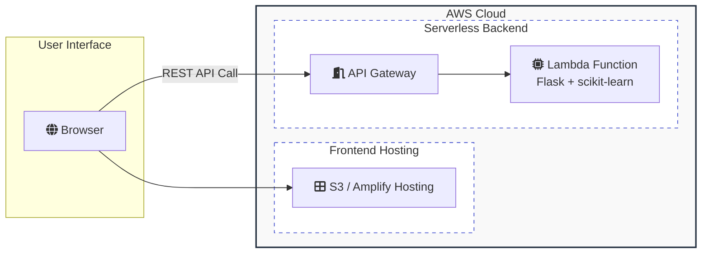

```text
 ___  _      _ _     ___                       _                 _
|   \(_)__ _(_) |_  | _ \___ __ ___  __ _ _ _ (_)___ ___ _ _    /_\  _ __ _ __
| |) | / _` | |  _| |   / -_) _/ _ \/ _` | ' \| (_-</ -_) '_|  / _ \| '_ \ '_ \
|___/|_\__, |_|\__| |_|_\___\__\___/\__, |_||_|_/__/\___|_|   /_/ \_\ .__/ .__/
       |___/                        |___/                           |_|  |_|
```
- - - - - - - - - - - - - - - - - - - - - - - - - - - - - - - - - - - - - - - 

## Welcome to my Digit Recogniser App repository !

This repo contains the source code and deployment configurations for a web app that performs real-time handwritten digit recognition, deployed via AWS Amplify. It utilises a backend serverless architecture of AWS Lambda with a Flask-based API handled by a Lambda adapter, together with Joblib serialisation of the trained scikit-learn MLP model.

The neural network (NN) model itself is an adapted and customised scikit-learn implementation of my previous (July 2022) _**modified**_ Python TensorFlow version, and trained on the popular MNIST data.

This deployment provides added functionalities where, in addition to uploading a handwritten image (as jpeg or png) for identification, users can also _**draw**_ a digit on an on-screen canvas using a mouse or touch interface, and simply click "Predict" to run it and obtain a classification (i.e. identification, inference) with percentage probability (confidence) of digit class.

## Architecture on AWS

```
Browser Frontend (S3/Amplify Hosting)  →  API Gateway  →  Lambda Backend (Flask + scikit-learn)
```
<br>


<br>

## Project Structure

```text

digit-recogniser-amplify-deploy/
├── .gitignore
├── LICENSE
├── README.md
├── Digit_Classifier_ML_Model.ipynb
├── sample_handwritten_digits/
├── amplify.yaml                          # Amplify build specification
├── frontend/                             # Static site (Amplify Hosting)
│     ├── index.html                      # Frontend markup
│     ├── style.css                       # Frontend styling
│     └── script.js                       # Frontend javascript
├── backend/                              # Lambda function (Python)
│     ├── app.py                          # Flask app wrapped for Lambda
│     ├── preprocess.py                   # Image preprocessing logic
│     ├── requirements.txt                # Python dependencies for Lambda
│     └── my_sklearn_model.joblib         # My trained model saved as joblib
└── template.yaml                         # AWS SAM template to deploy Lambda + API Gateway

```

<br>

For details of this adapted and customised NN model, and a step-by-step guide through my implementation, please refer to the Python notebook _**Digit_Classifier_ML_Model**_ in this repo. You may also run the notebook in your local Jupyter environment, where you may upload handwritten digit images for inference, or head to <placeholderURL> where you can also _draw_ digits for identification.

#### Enjoy !
