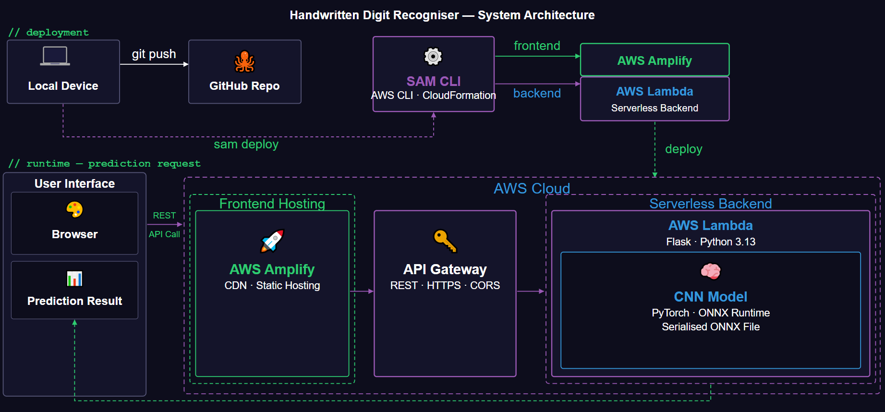

```text
 ___  _      _ _     ___                       _                 _
|   \(_)__ _(_) |_  | _ \___ __ ___  __ _ _ _ (_)___ ___ _ _    /_\  _ __ _ __
| |) | / _` | |  _| |   / -_) _/ _ \/ _` | ' \| (_-</ -_) '_|  / _ \| '_ \ '_ \
|___/|_\__, |_|\__| |_|_\___\__\___/\__, |_||_|_/__/\___|_|   /_/ \_\ .__/ .__/
       |___/                        |___/                           |_|  |_|
```
- - - - - - - - - - - - - - - - - - - - - - - - - - - - - - - - - - - - - - - 

## Welcome to my Digit Recogniser App repository !

This repo contains the source code and deployment configurations for a web app that performs real-time handwritten digit recognition deployed via AWS Amplify. It utilises a backend serverless architecture of AWS Lambda with a Flask-based API handled by a Lambda adapter, together with ONNX Runtime execution of a trained PyTorch CNN model exported to ONNX format.<br>
<br>

The original neural network (NN) model used in this mini-project was an adapted and customised scikit-learn implementation of my previous (July 2022) _**modified**_ Python TensorFlow version, and trained on the popular MNIST data. Live validation and testing revealed a serious flaw in that particular model: persistent misidentification of the digits 7 and 9 as 3.<br>

**Probable reason:** an MLP model trained on raw pixels may simply not be sophisticated enough, and is exhibiting spatial blindness, i.e. the model treats every pixel as an independent feature based strictly on its grid coordinates (x, y), and has no concept of spatial relationships or shapes.<br>

**Resolution Strategy:** Change model learning with architecture. Still using the MNIST dataset, a PyTorch implementation of a convolutional neural network (CNN) was carried out. This was further improved by means of _data augmentation_ and _image transformations_.<br>

An MLP flattens an image into a _1-D_ vector, destroying all _2-D_ pixel relationships and treating adjacent pixels no differently than distant ones. A CNN uses moving filters (kernels) to scan local pixel patches. This architecture forces the model to capture proximity-based visual patterns like edges and shapes regardless of where they appear in the frame. Consequently, the CNN preserves spatial context using far fewer parameters, whereas an MLP blindly attempts to learn separate, independent weights for every single pixel coordinate.<br>

PyTorch specifically enables this spatial advantage through its highly optimised _nn.Conv2d_ layers, which execute these sliding-filter calculations far more efficiently on a CPU than scikit-learn's dense matrix operations. So even without a GPU, PyTorch's dynamic graph architecture allows easy stacking and customisation of these convolutional layers to extract deep spatial features without running into the massive memory overhead of a flattened MLP.<br>

The result of this resolution strategy is a satisfactorily performing app now, without performance issues.<br>
<br>

Application functionalities:<br>
* Image Upload: Classify handwritten digits from uploaded jpeg and png files.
* Interactive Canvas: Draw digits directly using a mouse or touch interface.
* Inference Results: Obtain a digit classification along with its confidence percentage.<br>

## Architecture Description

1.<br>
Original scikit-learn MLP model:

```
Browser → Frontend → AWS Amplify (Hosting + API Management) → Lambda Backend (Flask + Lambda Adapter + NN Joblib)
```

<br>

2.<br>
Updated PyTorch CNN model:

```
Browser → Frontend → AWS Amplify (Hosting + API Management) → Lambda Backend (Flask + ONNX Runtime + CNN ONNX Model)
```

<br>

## Project Architecture (updated)



<br>

## Project Structure (Updated)

```text

digit-recogniser-amplify-deploy/
├── .gitignore
├── amplify.yaml                                # AWS Amplify build configuration
├── template.yaml                               # SAM / CloudFormation infrastructure definition
├── LICENSE
├── README.md
├── Digit_Classifier_ML_Model.ipynb             # Original MLP model notebook
├── Digit_Classifier_ML_Model_Updated.ipynb     # Updated CNN model notebook
│
├── backend/                                    # Lambda function package
│     ├── app.py                                # Flask handler + ONNX inference logic
│     ├── preprocess.py                         # Image preprocessing utilities
│     ├── mnist_cnn.onnx                        # Trained CNN model (ONNX format)
│     └── requirements.txt                      # Python dependencies
│
├── frontend/                                   
│     ├── index.html                            # Markup
│     ├── style.css                             # Stylesheet
│     └── script.js                             # JavaScript
│
└── sample_handwritten_digits/                  # Sample test images

```
<br>

## **Security Considerations**

The following precautions have been taken to address common bad actor methods:<br>

1. CORS + API URL:<br>

Web application vulnerabilities stemming from exposed backend endpoints, reverse-engineering of client-side source code, and unrestricted cross-origin sharing represent critical vectors of attack for direct API abuse, data exfiltration, and unauthorised cross-domain exploitation.<br>

**Solution:** API requests are routed through a proxy, keeping the backend endpoint out of client-side code. Cross-origin requests are restricted to the production frontend domain only. Please see [AWS CORS Documentation](https://docs.aws.amazon.com/AmazonS3/latest/userguide/cors.html)<br>
<br>

2. Error handling and debug mode:<br>

Vulnerabilities resulting from verbose error leakage, stack trace exposure, and active debug interfaces could lead to system mapping and remote code execution.<br>

**Solution:** Unhandled exceptions are logged server-side via Amazon CloudWatch without exposing internal details to the client. The application runs with debug mode disabled in all environments. Please see [AWS Prescriptive Logging Best Practices](https://docs.aws.amazon.com/prescriptive-guidance/latest/logging-monitoring-for-application-owners/logging-best-practices.html)<br>
<br>

3. Input validation:<br>

Vulnerabilities deriving from malicious file uploads and insecure canvas inputs expose web apps to system takeovers, data theft, and client-side code execution.<br>

**Solution:** Uploaded files are validated against an _allowlist_ of permitted image MIME types on both the frontend and backend. To prevent oversized input abuse and possible black hat probing via this method, payload size is capped at _MB (aha, did you expect me to reveal actual size? 😊 ). Please see [XSS (Cross Site Scripting)](https://owasp.org/www-community/attacks/xss/)<br>

<br>

Enjoy further details by checking out:

  1. [Original NN Model for this App](https://github.com/kea333/digit-recogniser-amplify-deploy/blob/main/Digit_Classifier_ML_Model.ipynb)<br>
      Original _Digit Classifier ML Model.ipynb_ notebook (deliberately left in repo) with detailed description of mini-project
      background and ML/NN engineering decisions.<br>

  2. [Updated NN Model for this App](https://github.com/kea333/digit-recogniser-amplify-deploy/blob/main/Digit_Classifier_ML_Model_Updated.ipynb)<br>
      Updated notebook _Digit Classifier ML Model Updated.ipynb_ - a straightforward problem fix without too much talk. Detailed explanations may be added in due course.

  3. [App on Demonstration](https://main.d28bhzqcmfxh8w.amplifyapp.com/)<br>
     In addition to uploading digit images for inference, you may also draw digits here.<br>
     
  4. [My other Projects Portfolio](https://webint.tech/)<br>
     Under construction - coming soon !
  